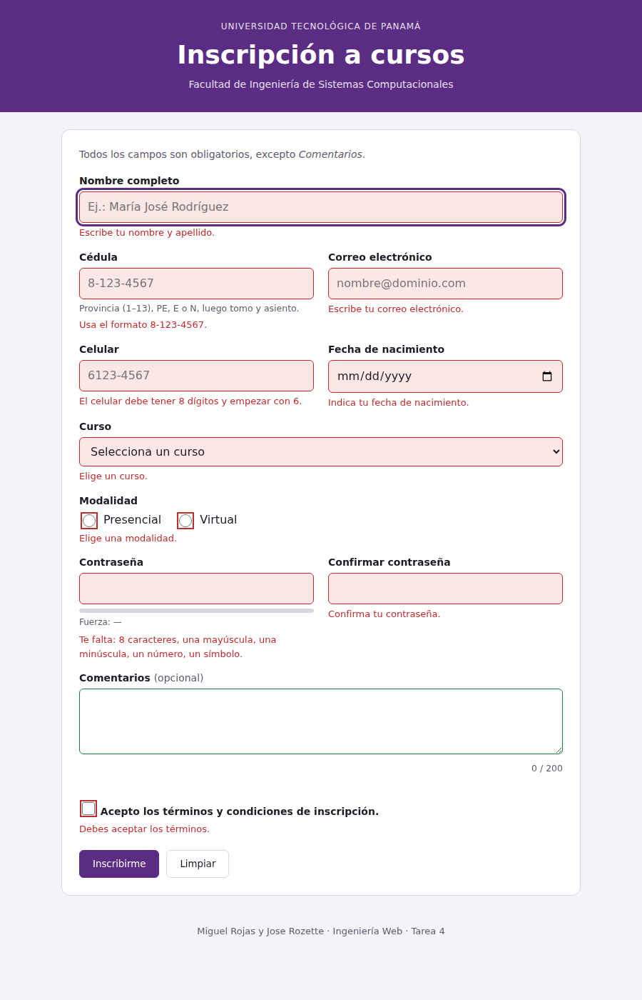
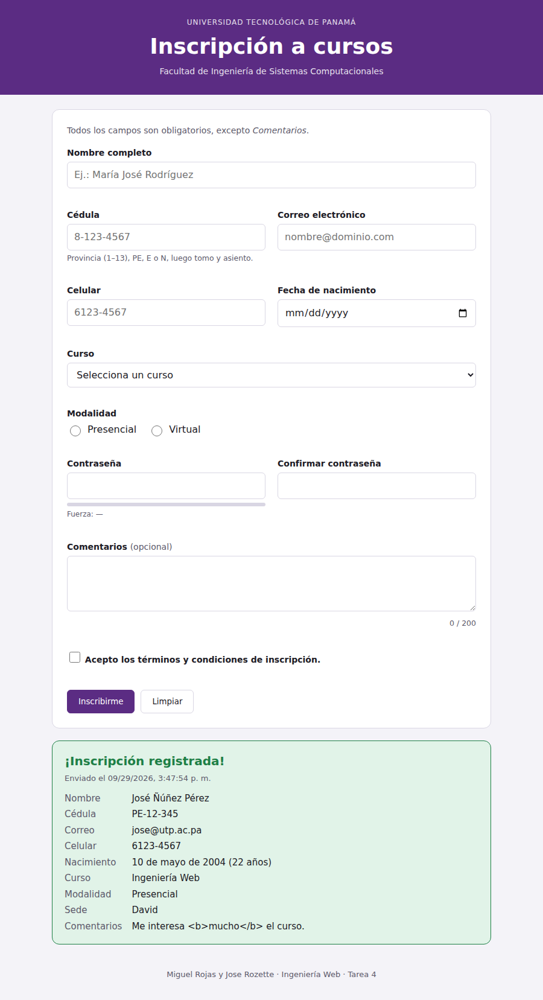

# Laboratorio DOM, eventos y validación de formularios

**Estudiantes:** Miguel Rojas y Jose Rozette
**Curso:** Ingeniería Web · Facultad de Ingeniería de Sistemas Computacionales · Universidad Tecnológica de Panamá
**Profesora:** Dra. Elba Valderrama Bahamóndez

## Enlaces

- **Repositorio:** https://github.com/MiguelARojas3103/Laboratorio-Avanzado-JS-DOM-Eventos-y-Validaci-n-de-formularios
- **GitHub Pages (tarea):** https://miguelarojas3103.github.io/Laboratorio-Avanzado-JS-DOM-Eventos-y-Validaci-n-de-formularios/
- **GitHub Pages (laboratorio guiado):** https://USUARIO.github.io/rojas-rozette-lab-dom/lab-dom/

## Estructura

```
rojas-rozette-lab-dom/
├── README.md
├── index.html          // portada con enlaces
├── lab-dom/            // laboratorio guiado (partes 1, 2 y 3)
│   ├── index.html
│   └── app.js
├── inscripcion/        // Tarea 4: formulario de inscripción
│   ├── index.html
│   ├── estilos.css
│   └── validacion.js
└── capturas/
    ├── errores.png
    └── confirmacion.png
```

## Tarea 4 · Formulario de inscripción

JavaScript puro, sin librerías. Cómo cumple cada requisito:

- **`novalidate`** en el formulario; los mensajes aparecen debajo de cada campo, nunca con `alert()`.
- **Objeto `reglas`** con una regla por campo; una sola función **`validarCampo`** las aplica todas (incluye radios y checkbox).
- **Patrón 3.4:** primero se valida al salir del campo (`blur` en fase de captura), luego en vivo (`input` / `change`) y al enviar se valida todo y el foco va al primer error.
- **Accesibilidad:** cada campo inválido recibe `aria-invalid="true"` y su mensaje está enlazado con `aria-describedby`; los mensajes usan `aria-live="polite"`.
- **Modalidad:** al elegir *Presencial* aparece *Sede* y pasa a ser obligatoria; con *Virtual* se oculta, se deshabilita y deja de validarse.
- **Contraseña:** 8+ caracteres, mayúscula, minúscula, número y símbolo, con indicador de fuerza en vivo. La confirmación se revalida cuando cambia la contraseña.
- **Comentarios:** contador en vivo `n / 200` que cambia de color al pasar de 180.
- **Envío válido:** sin recargar la página, se crea con `createElement` una tarjeta con los datos (sin la contraseña) y se reinicia el formulario. Todos los datos se insertan con `textContent`, nunca con `innerHTML`.

## Capturas

**Errores al enviar vacío**



**Tarjeta de confirmación**


